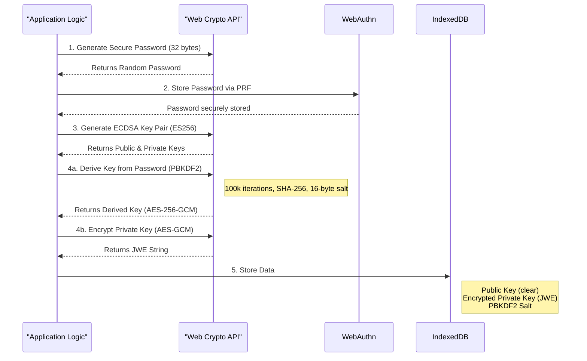

# Technical Deep-Dive: Key Management and Encryption

This document provides a detailed technical breakdown of the cryptographic processes used for key management and encryption within the application.

## Core Security Principles

The security of the user's private key relies on a multi-layered encryption strategy:

1.  **Passwordless Authentication**: WebAuthn is used to ensure that the user is physically present and authenticated with their device before any cryptographic operations can occur.
2.  **Key Derivation**: A strong key derivation function (`PBKDF2`) is used to transform a lower-entropy password into a high-entropy cryptographic key.
3.  **Strong Encryption**: The private key itself is encrypted using a robust, authenticated encryption algorithm (`AES-GCM`).

## Detailed Cryptographic Flow

### 1. Secure Password Generation

-   **File**: [`src/services/keyManagement/passwordManager.ts`](src/services/keyManagement/passwordManager.ts:177)
-   **Process**: A 32-byte, cryptographically secure random password is generated using `window.crypto.getRandomValues()`. This password acts as the primary secret for encrypting the private key.

### 2. WebAuthn PRF (Pseudo-Random Function)

-   **File**: [`src/services/keyManagement/passwordManager.ts`](src/services/keyManagement/passwordManager.ts:130)
-   **Library**: `@adorsys-gis/web-auth-prf`
-   **Process**: The generated password is not stored directly. Instead, it is passed to the WebAuthn PRF extension. When the user registers a new passkey (via PIN, biometrics, etc.), the browser's WebAuthn implementation securely binds this password to the user's credential. The password can only be retrieved after a successful future WebAuthn authentication ceremony. This effectively uses the user's device security as a key to unlock the password.

### 3. Key Pair Generation

-   **File**: [`src/services/keyManagement/generateKey.ts`](src/services/keyManagement/generateKey.ts:3)
-   **Algorithm**: `ECDSA` with the `ES256` curve.
-   **Library**: `jose`
-   **Process**: A standard elliptic curve key pair is generated. The private key is marked as `extractable` to allow for the subsequent encryption step.

### 4. Private Key Encryption

This is a multi-step process that transforms the password from WebAuthn into a key suitable for encrypting the private key.

-   **File**: [`src/services/keyManagement/encrypt.ts`](src/services/keyManagement/encrypt.ts:6)

#### 4a. Key Derivation (PBKDF2)

-   **Function**: `window.crypto.subtle.deriveKey`
-   **Algorithm**: `PBKDF2` (Password-Based Key Derivation Function 2)
-   **Parameters**:
    -   **Hash Function**: `SHA-256`
    -   **Salt**: A new, randomly generated 16-byte salt (`window.crypto.getRandomValues()`) is created for each encryption operation. This prevents rainbow table attacks.
    -   **Iterations**: `100,000`. A high number of iterations increases the computational cost for an attacker trying to brute-force the password.
-   **Process**: The password retrieved from WebAuthn is combined with the salt and processed through 100,000 rounds of `SHA-256`. This produces a new, 256-bit key that is computationally expensive to reverse.

#### 4b. Symmetric Encryption (AES-GCM)

-   **Function**: `jose.CompactEncrypt`
-   **Algorithm**: `AES-GCM` (Advanced Encryption Standard in Galois/Counter Mode) with a 256-bit key.
-   **JWE Header**: `{ "alg": "dir", "enc": "A256GCM" }`
    -   `alg: "dir"`: Specifies "direct encryption," meaning the derived key from PBKDF2 is used directly to encrypt the payload.
    -   `enc: "A256GCM"`: Specifies the content encryption algorithm. `AES-GCM` is an authenticated encryption (AEAD) algorithm, which means it provides both confidentiality (the data is secret) and integrity/authenticity (the data cannot be tampered with without detection).
-   **Process**: The `PBKDF2`-derived key is used to encrypt the JSON representation of the private key. The output is a compact JWE (JSON Web Encryption) string.

### 5. Storage

-   **File**: [`src/services/keyManagement/storeKey.ts`](src/services/keyManagement/storeKey.ts:6)
-   **Location**: IndexedDB
-   **Data Stored**:
    -   The unencrypted public key.
    -   The JWE string containing the encrypted private key.
    -   The 16-byte salt used in the `PBKDF2` key derivation process. The salt is not a secret, but it must be stored alongside the encrypted data to be used for decryption.
